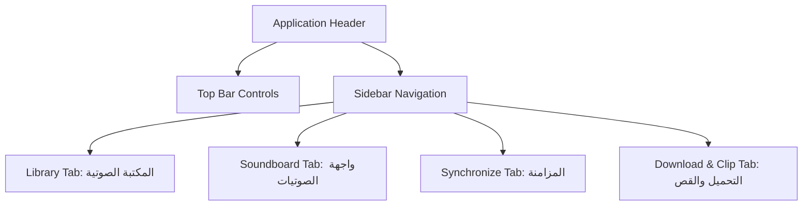

# StreamAudio Core — Machine-Readable Design System & UI Specification
**Version 2.0.0 (AI-Ready)**  
**Status: Production Specifications - Automated Parsing Mode**  

---

## 1. System Constraints & Global Parameters

This section defines the absolute boundaries for the runtime application window.

```json
{
  "system_constraints": {
    "viewport": {
      "width": 1280,
      "height": 780,
      "scaling": "fixed",
      "overflow": "hidden",
      "chrome": "decoration-free (tauri custom window)"
    },
    "localization": {
      "direction": "RTL",
      "primary_language": "ar"
    }
  }
}
```

---

## 2. Design Tokens (W3C Standard Schema)

### 2.1 Color Tokens

All HEX values must be parsed with strict contrast ratios against the background canvas.

```json
{
  "color": {
    "bg": {
      "main": { "value": "#2F3E46", "type": "color" },
      "gradient_end": { "value": "#354F52", "type": "color" }
    },
    "surface": {
      "card": { "value": "rgba(53, 79, 82, 0.45)", "type": "color" },
      "input": { "value": "rgba(47, 62, 70, 0.65)", "type": "color" }
    },
    "text": {
      "primary": { "value": "#CAD2C5", "type": "color" },
      "secondary": { "value": "#a4b3b8", "type": "color" },
      "muted": { "value": "#CAD2C5", "type": "color" }
    },
    "accent": {
      "primary": { "value": "#84A98C", "type": "color" },
      "hover": { "value": "#8ba2ad", "type": "color" },
      "disabled": { "value": "#273033", "type": "color" }
    },
    "status": {
      "success": { "value": "#88bca3", "type": "color" },
      "warning": { "value": "#cfac7c", "type": "color" },
      "error": { "value": "#cf7c7c", "type": "color" }
    },
    "border": {
      "default": { "value": "rgba(255, 255, 255, 0.08)", "type": "color" },
      "hover": { "value": "rgba(255, 255, 255, 0.16)", "type": "color" }
    }
  }
}
```

### 2.2 Spacing Grid Tokens

```json
{
  "spacing": {
    "xs": { "value": 4, "type": "spacing", "unit": "pixel" },
    "sm": { "value": 8, "type": "spacing", "unit": "pixel" },
    "md": { "value": 12, "type": "spacing", "unit": "pixel" },
    "lg": { "value": 16, "type": "spacing", "unit": "pixel" },
    "xl": { "value": 24, "type": "spacing", "unit": "pixel" }
  }
}
```

### 2.3 Typography Scale

```json
{
  "typography": {
    "font_family": {
      "primary": { "value": "'TheYearofHandicrafts', system-ui, -apple-system, sans-serif" }
    },
    "scale": {
      "title": {
        "font_size": { "value": "1.5rem" },
        "line_height": { "value": "1.875rem" },
        "font_weight": { "value": "700" }
      },
      "subtitle": {
        "font_size": { "value": "0.875rem" },
        "line_height": { "value": "1.25rem" },
        "font_weight": { "value": "500" }
      },
      "body": {
        "font_size": { "value": "0.8125rem" },
        "line_height": { "value": "1.125rem" },
        "font_weight": { "value": "400" }
      },
      "small": {
        "font_size": { "value": "0.6875rem" },
        "line_height": { "value": "0.9375rem" },
        "font_weight": { "value": "500" }
      }
    }
  }
}
```

---

## 3. Interactive Components State Machines

### 3.1 Button Component Mappings

```json
{
  "components": {
    "buttons": {
      "primary": {
        "states": {
          "default": { "classes": "bg-[#6c8089] text-zinc-50 border border-[#6c8089]" },
          "hover": { "classes": "bg-[#8ba2ad] text-white shadow-[0_0_15px_rgba(139,162,173,0.25)]" },
          "active": { "classes": "scale-95 bg-[#6c8089]" },
          "focus": { "classes": "ring-2 ring-white/20 outline-none" },
          "disabled": { "classes": "bg-[#273033] text-zinc-500 border-zinc-800 cursor-not-allowed opacity-50" }
        }
      },
      "secondary": {
        "states": {
          "default": { "classes": "bg-[#1a1a1a] border border-white/5 text-zinc-300" },
          "hover": { "classes": "bg-zinc-800 text-white border-white/10" },
          "active": { "classes": "scale-95" },
          "disabled": { "classes": "border-white/5 text-zinc-600 opacity-40 cursor-not-allowed" }
        }
      },
      "danger": {
        "states": {
          "default": { "classes": "bg-red-950/20 border border-red-900/30 text-red-400" },
          "hover": { "classes": "bg-red-950/45 border-red-800/50 text-red-300" },
          "active": { "classes": "scale-95" },
          "disabled": { "classes": "border-red-950/20 text-red-900/30 opacity-40 cursor-not-allowed" }
        }
      }
    }
  }
}
```

### 3.2 Form Controls & Input Specifications

```json
{
  "inputs": {
    "text_field": {
      "states": {
        "default": { "classes": "bg-zinc-950 border border-white/10 text-white px-3 py-2 rounded-xl text-xs" },
        "hover": { "classes": "border-white/20" },
        "focus": { "classes": "border-[#6c8089] ring-2 ring-[#6c8089]/30 outline-none" },
        "error": { "classes": "border-red-500 ring-2 ring-red-500/20" },
        "success": { "classes": "border-green-500 ring-2 ring-green-500/20" }
      }
    },
    "dropdown": {
      "container": { "classes": "relative w-48 z-50" },
      "trigger": { "classes": "w-full flex items-center justify-between rounded-xl bg-zinc-900 border border-zinc-800 px-3 py-1.5 text-xs text-white focus:outline-none cursor-pointer transition hover:border-[#6c8089]/40 active:scale-[0.985] text-right" },
      "menu_box": { "classes": "absolute left-0 min-w-[280px] md:min-w-[320px] bottom-full mb-1.5 z-[110] bg-zinc-950 border border-white/10 rounded-xl shadow-[0_10px_30px_rgba(0,0,0,0.8)] max-h-56 overflow-y-auto custom-scrollbar flex flex-col p-1" },
      "option": { "classes": "w-full text-right px-3 py-2 text-xs rounded-lg transition-colors cursor-pointer whitespace-nowrap text-zinc-300 hover:bg-white/5 hover:text-white" }
    },
    "audio_faders": {
      "track": { "classes": "h-1.5 bg-zinc-800 rounded-full" },
      "fill": { "classes": "bg-[#6c8089]" },
      "thumb": { "classes": "w-4 h-4 rounded-full bg-white border border-[#6c8089] shadow-md cursor-pointer hover:scale-110 active:scale-95 transition-transform" }
    }
  }
}
```

---

## 4. Audio-Specific Component Specs

```json
{
  "audio_components": {
    "sound_cards": {
      "states": {
        "normal": { "classes": "glass-panel p-4 rounded-2xl border border-white/10 relative" },
        "loading": { "classes": "animate-pulse bg-zinc-900/50" },
        "empty": { "classes": "border-dashed border-white/5 bg-black/40 text-gray-500/50" }
      }
    },
    "audio_waveforms": {
      "canvas": { "classes": "waveform-canvas" },
      "states": {
        "default": { "opacity_factor": 0.35 },
        "played_active": { "opacity_factor": 1.0 }
      }
    },
    "vu_meters": {
      "thresholds": [
        { "level_db": "less than -6", "hex": "#88bca3", "alias": "success" },
        { "level_db": "-6 to 0", "hex": "#cfac7c", "alias": "warning" },
        { "level_db": "greater than 0", "hex": "#cf7c7c", "alias": "clipping" }
      ]
    }
  }
}
```

---

## 5. Layout & Structural Specification

This section maps responsive grid constraints and column rules for code generators.

```json
{
  "layouts": {
    "breakpoints": {
      "desktop": {
        "min_width": 1024,
        "library_columns": 5,
        "sampler_max_width": "460px",
        "pad_grid_aspect": "aspect-square"
      },
      "laptop": {
        "max_width": 1023,
        "library_columns": 3,
        "sampler_max_width": "460px",
        "pad_grid_aspect": "aspect-square"
      }
    }
  }
}
```

### Navigation Hierarchy Map



---

## 6. Iconography & Motion Choreography

### 6.1 Icons Sizing tokens

```json
{
  "icons": {
    "library": "Lucide React",
    "sizes": {
      "small": { "pixel_size": 12 },
      "medium": { "pixel_size": 16 },
      "large": { "pixel_size": 24 }
    },
    "stroke_weights": {
      "default": 2.0,
      "subtle": 1.5,
      "decorative": 1.0
    }
  }
}
```

### 6.2 Micro-interactions & Transitions

```json
{
  "transitions": {
    "easing_curves": {
      "ease-in-out": "cubic-bezier(0.4, 0, 0.2, 1)",
      "ease-out": "cubic-bezier(0, 0, 0.2, 1)"
    },
    "interactions": [
      {
        "trigger": "onPointerDown",
        "target": "Shortcut pad button",
        "duration_ms": 50,
        "effect": "scale down to 0.95"
      },
      {
        "trigger": "onMouseEnter",
        "target": "Shortcut pad button",
        "duration_ms": 150,
        "effect": "scale up to 1.04"
      },
      {
        "trigger": "samplerPage state change",
        "target": "Sampler grid viewport",
        "duration_ms": 120,
        "curve": "ease-in-out",
        "effect": "scale: 0.97 -> 1.0, opacity: 0 -> 1"
      },
      {
        "trigger": "onClickToggle",
        "target": "Sidebar panel width",
        "duration_ms": 200,
        "curve": "ease-out",
        "effect": "shrink width to 64px, text display none"
      }
    ]
  }
}
```

---

## 7. Brand & Logo Constraints

```json
{
  "brand": {
    "sidebar_logo": {
      "states": {
        "expanded": {
          "max_width_px": 160,
          "max_height_px": 40,
          "alignment": "pr-5 (RTL header padding)"
        },
        "collapsed": {
          "width_px": 32,
          "height_px": 32,
          "alignment": "centered within 64px width"
        }
      }
    },
    "splash_screen": {
      "logo_height_px": 96,
      "animation": {
        "type": "opacity breathing",
        "min_opacity": 0.4,
        "max_opacity": 1.0,
        "duration_ms": 2000,
        "curve": "ease-in-out"
      }
    }
  }
}
```
