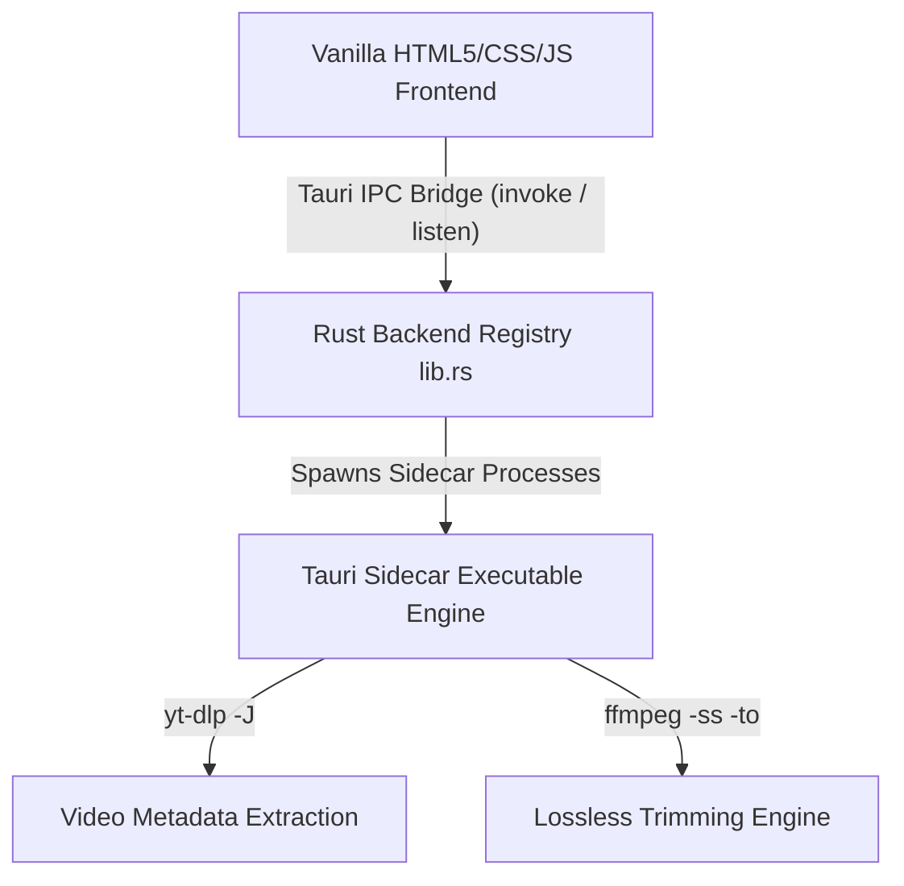

# Developer Onboarding & Architecture Guide

## 🚀 1. Executive Project Summary
**A.3 Downloader** is a high-performance desktop application engineered for advanced media scraping, queue-managed downloading, and localized media editing/trimming. Designed as a standalone utility, the project provides a rich, responsive interface combined with a robust system-level processing backend.

### Core Capabilities
*   **Interactive HTML5 Timeline Editor**: A visual workspace that allows developers/users to easily select precise start and end times using draggable timeline sliders with automated loops.
*   **Real-Time Time-Capturing ("الآن" / "Now" Feature)**: A micro-utility that grabs the media player's current frame-time and fills the trimming inputs dynamically, eliminating manual keystrokes.
*   **Cross-Browser Cookie Extraction**: Bypasses strict anti-bot mechanisms (like Cloudflare CAPTCHAs, rate limiting, and IP blocks) on platforms like TikTok and YouTube by letting users share session cookies from Chrome, Edge, Firefox, or Brave directly into the downloader engine.
*   **Dynamic yt-dlp Updates**: Uses system-level commands to automatically keep the scraper engine updated to the latest nightly builds, maintaining compatibility with breaking API modifications of third-party platforms.

---

## 🛠️ 2. Architecture & Technical Stack
The system follows a hybrid architecture, combining the performance and safety of a Rust backend with the visual flexibility of a Vanilla JS/HTML5 frontend using **Tauri v2**.



### Core Architecture Components
1.  **Core Framework**: **Tauri v2**. Implements the system bridges, window configuration, system tray menus, and filesystem security sandboxing.
2.  **Frontend Logic ([src/main.js](file:///d:/A.3%20Downloader/src/main.js))**:
    *   No heavyweight frontend frameworks (React/Vue/Angular) are used, ensuring zero runtime overhead and rapid initialization.
    *   Directly interacts with the DOM to handle custom timeline manipulation, toast notifications, UI tabs (Queue vs. History), and playback controls.
    *   Invokes backend commands and registers event listeners for progress notifications (`listen("progress", ...)`).
3.  **Backend Core ([src-tauri/src/lib.rs](file:///d:/A.3%20Downloader/src-tauri/src/lib.rs))**:
    *   Exposes a series of Rust-compiled API endpoints (`#[tauri::command]`) for frontend invocations.
    *   Manages system level structures such as `DownloadState` inside a thread-safe `Mutex` for asynchronous process execution and cancellation.
    *   Parses stdout streams in real-time, extracting percentage, speed, and ETA stats, and emits normalized data back to the frontend.
4.  **Sidecar Execution Engine ([src-tauri/bin/](file:///d:/A.3%20Downloader/src-tauri/bin))**:
    *   Uses Tauri's `externalBin` feature to ship platform-specific binaries inside the installer:
        *   **`yt-dlp`**: Handles intensive scraping and parsing of links (single videos or whole playlists).
        *   **`ffmpeg`**: Handles audio/video format merging (e.g., merging separate HD video streams with audio tracks) and lossless local media slicing (`-c copy` mode).

---

## 📁 3. Repository Directory Structure
The following directory tree maps the workspace organization:

```text
A.3 Downloader/
├── .gitignore
├── .vscode/
│   └── extensions.json            # Recommended VS Code configurations and plugins
├── package.json                   # Package manifest (includes dev cli and script triggers)
├── package-lock.json
├── README.md                      # Default project introduction template
├── DEVELOPER_GUIDE.md             # Developer onboarding guide in Arabic
├── DEVELOPER1_GUIDE.md            # Advanced architecture guide in English (This document)
├── releases/                      # Staged release distribution versions
│   └── v0.2.0/
│       ├── a3-downloader_0.2.0_x64-setup.exe  # Compiled desktop installer
│       └── release_notes.md       # Change log and release notes
├── src/                           # Frontend application files
│   ├── assets/                    # Graphical assets and logos
│   ├── index.html                 # UI layout template and DOM elements
│   ├── main.js                    # Controller code, state handlers, and IPC communication
│   └── styles.css                 # CSS styles and custom theme configurations
└── src-tauri/                     # Tauri app configuration and Rust source files
    ├── Cargo.lock
    ├── Cargo.toml                 # Cargo crates dependency manifest
    ├── build.rs                   # Custom Tauri builder script
    ├── tauri.conf.json            # Global Tauri configuration file
    ├── capabilities/              # Tauri v2 security policies and plugin permissions
    │   └── default.json
    ├── icons/                     # App and tray desktop icon assets
    └── src/
        ├── lib.rs                 # Primary backend logic, CLI wrapper, and custom commands
        └── main.rs                # Windows system entry point
```

---

## 💻 4. Local Environment Setup & Compilation
To configure the environment for local development and build testing, follow these steps:

### System Prerequisites
*   **Node.js**: Version 18.0.0 or higher.
*   **Rust Toolchain**: Install `rustup` to manage the Rust compiler and cargo tool.
*   **C++ Build Tools**: Windows developers must install the C++ Build Tools (via Visual Studio Installer) to compile Rust dependencies.
*   **VS Code Extensions**: Ensure `tauri-vscode` and `rust-analyzer` are enabled.

### Quick-Start Setup

1.  **Install Node Dependencies**:
    ```powershell
    npm install
    ```

2.  **Run Development Server**:
    ```powershell
    npm run tauri dev
    ```
    This launches the Tauri desktop client in hot-reload mode. Any frontend or Rust code changes will trigger an automatic client refresh or recompilation.

### Hard Constraints
*   **Window Bounds**: The window width and height are strictly constrained to $900 \times 600$ pixels and locked against resizing inside [tauri.conf.json](file:///d:/A.3%20Downloader/src-tauri/tauri.conf.json#L15-L17) (`resizable: false`). Do not alter these parameters as the frontend UI design is tailormade to fit this layout box precisely.

---

## 🔗 5. Cross-Project Integration Blueprint
This guide details how to link or integrate A.3 Downloader with external scripts, automation flows, or other applications.

### Scenario A: Subprocess / CLI Mode
For external scheduling software or orchestration pipelines (e.g., Python scripts, Jenkins agents, Cron tasks), A.3 Downloader can be invoked directly as a background subprocess.

*   **Implementation Steps**:
    1.  Add CLI argument parsing in `src-tauri/src/lib.rs` (using the `clap` crate or Tauri's CLI plugin).
    2.  Define specific command-line arguments to accept inputs programmatically:
        ```bash
        a3-downloader.exe --url "https://tiktok.com/@user/video/..." --format mp4 --quality 720p --output-dir "D:\Storage" --auto-exit
        ```
    3.  In Rust's `setup` hook, match these arguments. If arguments are present, trigger `download_video` silently and exit the program (`std::process::exit(0)`) upon completion, bypassing the visual GUI.

---

### Scenario B: IPC / Local WebSockets API
If you need external web applications, browser extensions, or local services to communicate with the downloader while it runs, you can embed a lightweight communication interface inside the Rust backend.

*   **Implementation Steps**:
    1.  Add `axum` or `tokio-tungstenite` to your dependencies in `src-tauri/Cargo.toml`.
    2.  Within the `setup` block of `src-tauri/src/lib.rs`, spawn an asynchronous tokio thread to bind to a local port (e.g. `127.0.0.1:4892`):
        ```rust
        // Conceptual implementation pattern inside lib.rs
        .setup(|app| {
            let app_handle = app.app_handle().clone();
            tauri::async_runtime::spawn(async move {
                let listener = tokio::net::TcpListener::bind("127.0.0.1:4892").await.unwrap();
                while let Ok((stream, _)) = listener.accept().await {
                    let app_clone = app_handle.clone();
                    tauri::async_runtime::spawn(async move {
                        // Handle WebSocket or HTTP JSON request
                        // e.g. Trigger app_clone.emit("progress", payload) or invoke download_video programmatically
                    });
                }
            });
            Ok(())
        })
        ```
    3.  This setup enables external scripting systems (like local Python automation scripts) to query current queue items or trigger scrapers through simple REST/WebSocket endpoints.

---

### Scenario C: Frontend Webview Messaging
When embedding or wrapping external web pages within the Tauri application view:

*   **Implementation Steps**:
    1.  Configure Tauri's security permissions in `capabilities/default.json` to allow the target external domain permission to call Tauri commands.
    2.  Inject Tauri's script bridge into the webview. The wrapped page can then invoke backend commands or listen to event channels directly from the browser context:
        ```javascript
        // Invoke backend video probing from wrapped web app
        window.__TAURI__.core.invoke("probe_video", { 
            url: "https://youtube.com/watch?v=...", 
            cookies_from: "chrome" 
        }).then(data => {
            console.log("Video Title:", data.title);
        });
        ```
