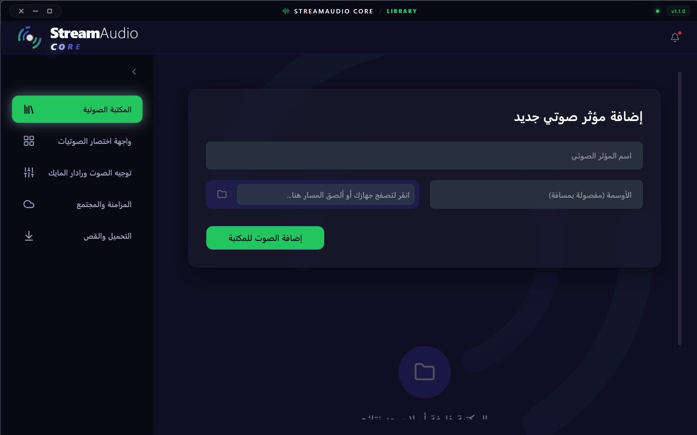
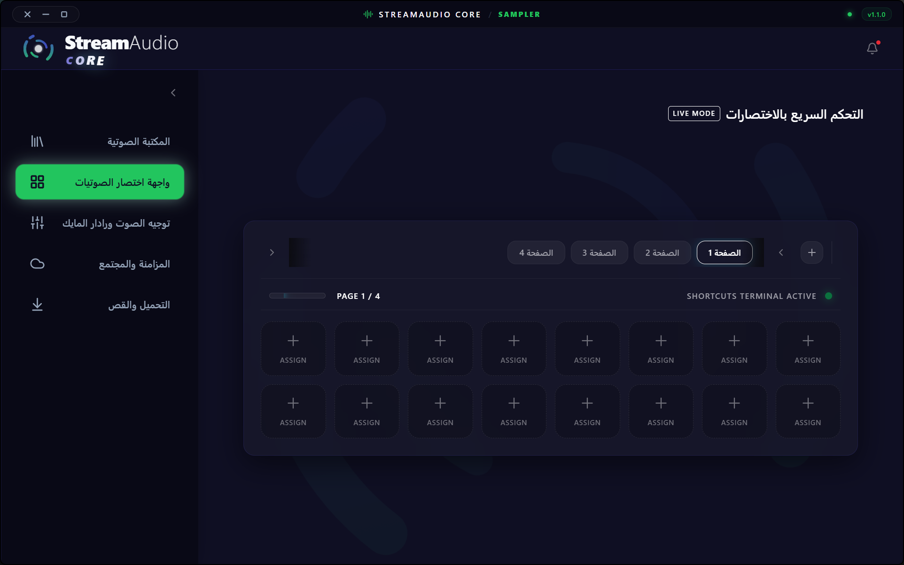
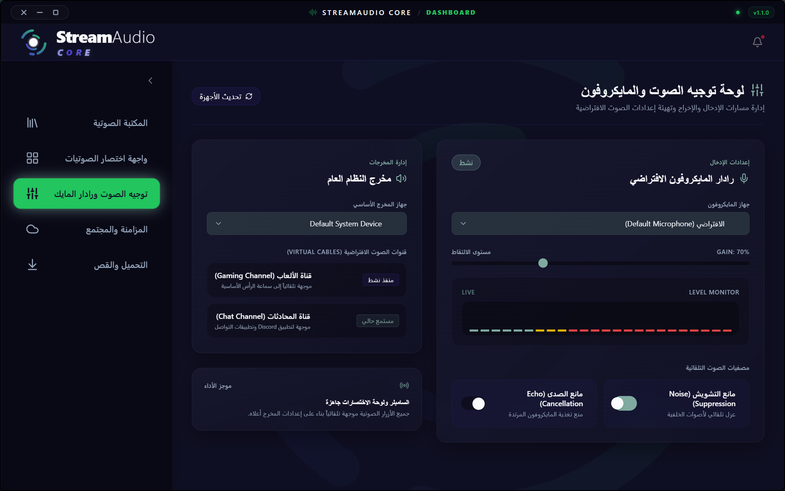
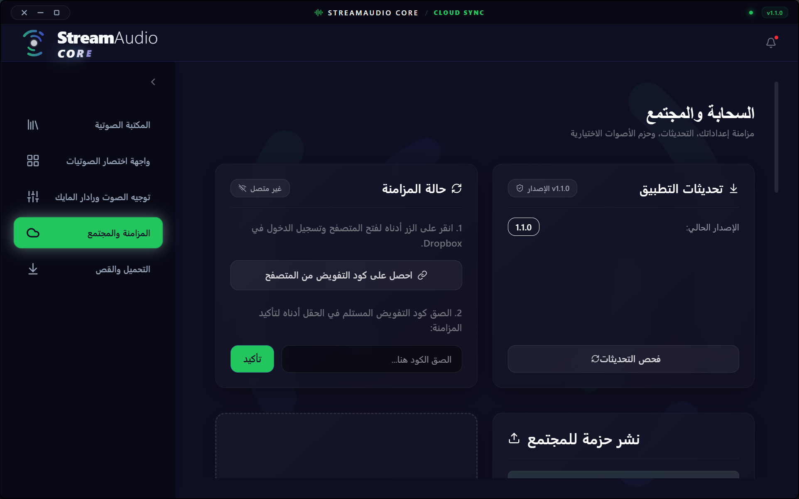
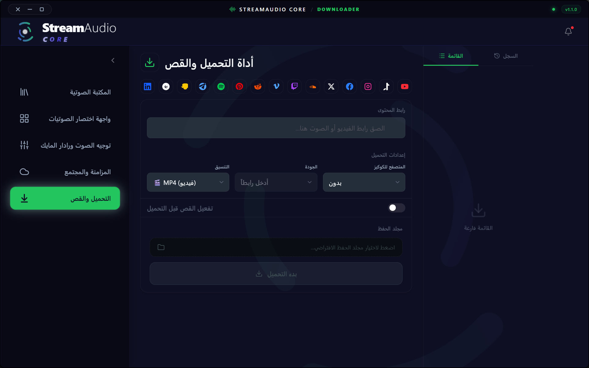

<div align="center">
  
  <h1>🎵 StreamAudioCore</h1>

  <p>
    <b>A high-performance desktop application for advanced audio and media processing.</b>
    <br/>
    <i>مزيج من الأداء الفائق والواجهة العصرية لمعالجة وتشغيل الصوتيات.</i>
  </p>

  <p>
    <a href="#-english"><b>English</b></a> •
    <a href="#-العربية"><b>العربية</b></a>
  </p>

  <p>
    
    
    
    
  </p>

  <br/>
  
  
</div>

---

## 🌍 Languages / اللغات
- [English Documentation](#-english)
- [التوثيق باللغة العربية](#-العربية)

---

<h2 id="-english">🇬🇧 English</h2>

**StreamAudioCore** is an integrated software project engineered with **Tauri** to deliver a blazing-fast, secure, and visually stunning desktop experience. With a core engine written in **Rust** and a frontend powered by **React & TypeScript**, it provides an advanced environment for processing and playing audio and media with ultra-high performance.

### ✨ Key Features

- 🚀 **Blazing Fast Performance:** Powered by a Rust backend, ensuring minimal memory footprint and instant responsiveness compared to traditional electron-based apps.
- 🎨 **Modern & Fluid UI:** A highly polished user interface built with React, TypeScript, and Vite to guarantee an exceptional user experience (UX).
- 🌊 **Real-time Waveform Rendering:** Smooth, precise, and hardware-accelerated audio waveform visualization.
- 🎛️ **Advanced Audio Routing:** Granular control over audio channels with seamless output device routing and selection.
- 🔠 **Premium Typography:** Integrates custom, high-quality fonts to elevate the visual aesthetics.

### 📸 Application Gallery

<div align="center">
  
  
  
  
</div>

### 📂 Architecture Overview
```text
StreamAudioCore/
├── streamaudio-core/      # Core Application (React UI + Rust Backend)
├── front/                 # Custom Typography Assets
├── DESIGN_SYSTEM.md       # Comprehensive UI/UX Design Guidelines
├── DEVELOPER1_GUIDE.md    # Developer Documentation & Architecture
└── RELEASE_WORKFLOW.md    # Deployment & CI/CD Workflows
```

### 🛠️ Getting Started

To compile and run the project locally, ensure you have the following installed:
1. **[Node.js](https://nodejs.org/):** (v18.x or newer).
2. **[Rust Toolchain](https://rustup.rs/):** For compiling the core backend.
3. **C++ Build Tools:** For Windows (Visual Studio Build Tools with MSVC).

#### 🚀 Quick Installation
```bash
# Navigate to the core application directory
cd streamaudio-core

# Install frontend dependencies
npm install

# Launch the development server
npm run tauri dev
```

---

<h2 id="-العربية">🇸🇦 العربية</h2>

**StreamAudioCore** هو مشروع برمجي متقدم يعتمد على إطار عمل **Tauri** لإنشاء تطبيقات سطح مكتب سريعة، آمنة، ومبهرة بصرياً. يجمع المشروع بين قوة لغة **Rust** في معالجة العمليات الخلفية، ومرونة **React** لتوفير واجهة مستخدم احترافية وتجربة استماع وتعديل صوتيات لا مثيل لها.

### ✨ الميزات الرئيسية

- 🚀 **أداء خارق للعادة:** بفضل الاعتماد على محرك Rust، يستهلك التطبيق موارد أقل بكثير من تطبيقات سطح المكتب التقليدية ويوفر استجابة فورية.
- 🎨 **واجهة عصرية وانسيابية:** تم تصميم وبناء واجهة المستخدم بعناية باستخدام أحدث تقنيات الويب (React, TypeScript, Vite).
- 🌊 **تصيير الموجات الصوتية (Waveform):** عرض حي ودقيق لموجات الصوت مع تأثيرات بصرية مدعومة بتسريع الأجهزة (Hardware Acceleration).
- 🎛️ **توجيه وتحكم صوتي متقدم:** إمكانية فصل قنوات الصوت والتحكم الدقيق في مخارج الصوت (Output Devices) بمرونة تامة.
- 🔠 **هوية بصرية مميزة:** استخدام خطوط مدفوعة ومخصصة تم دمجها برمجياً لرفع مستوى الجمالية في واجهات الاستخدام.

### 📸 معرض الصور

<div align="center">
  
  
  
  
</div>

### 🛠️ إعداد بيئة التطوير والتشغيل

للشروع في تطوير أو تشغيل المشروع محلياً، يرجى التأكد من توفر الأدوات التالية:
1. **[Node.js](https://nodejs.org/):** (الإصدار 18 أو أحدث).
2. **[Rust & Cargo](https://rustup.rs/):** المحول البرمجي (Compiler) الخاص بلغة Rust.
3. **أدوات بناء C++:** لنظام التشغيل Windows (Visual Studio Build Tools).

#### 🚀 خطوات التشغيل السريع
```bash
# الانتقال إلى مجلد التطبيق
cd streamaudio-core

# تثبيت الاعتماديات الخاصة بالواجهة
npm install

# تشغيل بيئة التطوير الخاصة بـ Tauri
npm run tauri dev
```

---

<br/>
<div align="center">
  <b>Developed with ❤️ & Excellence | صُنع بشغف 💻 وتميز</b>
</div>
